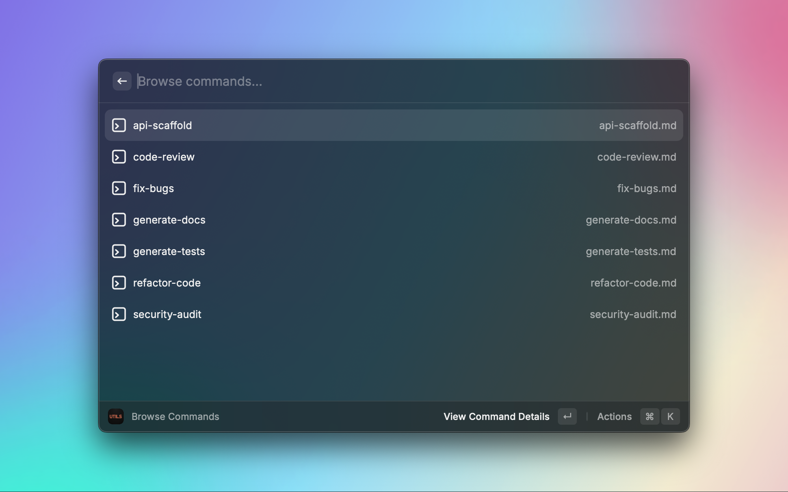
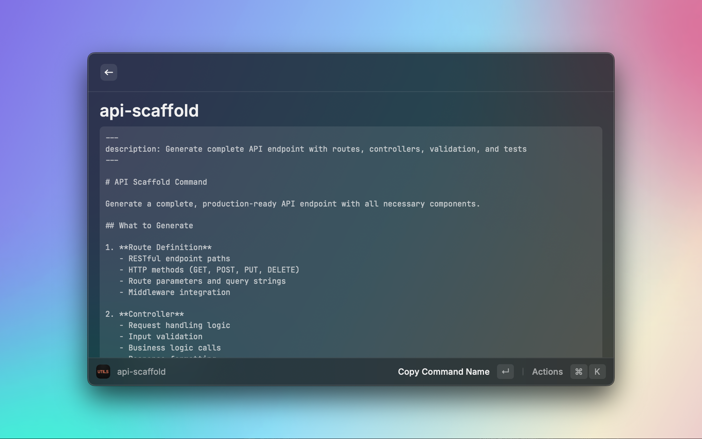
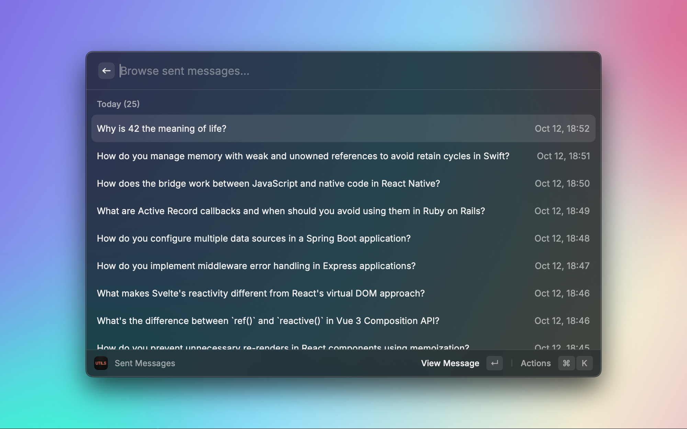
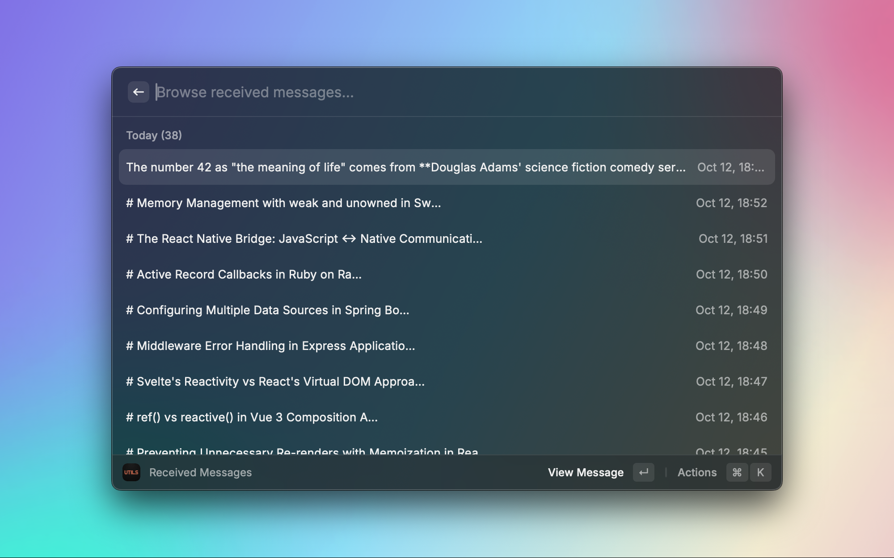
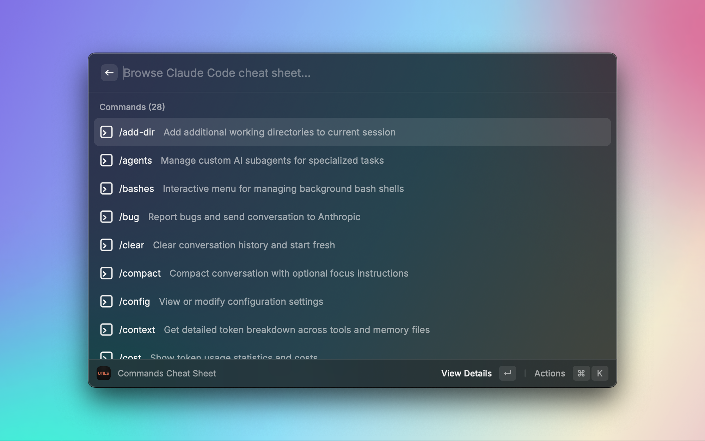
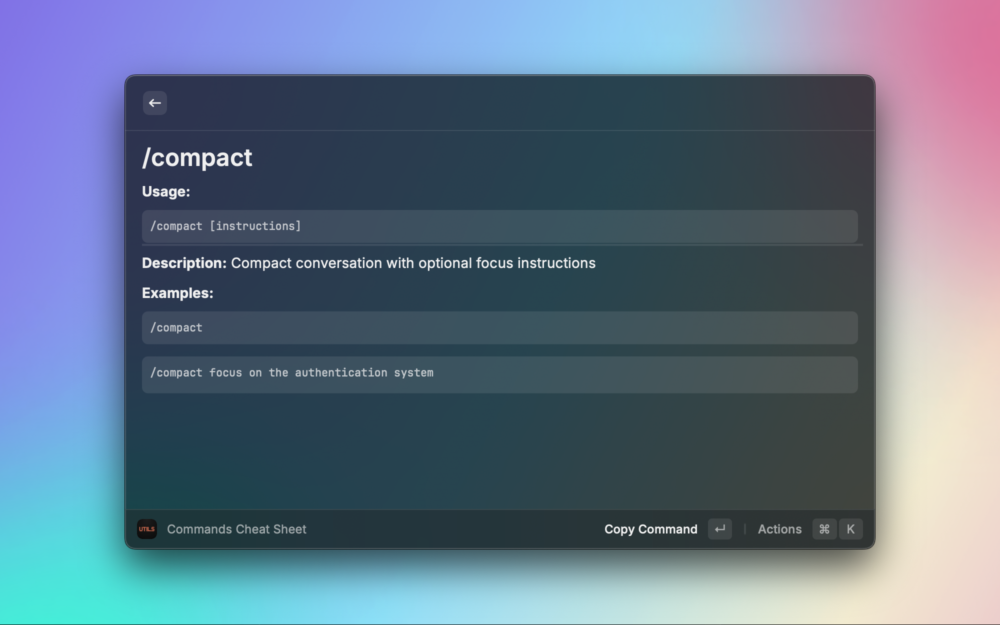

# Claude Code Utils

A powerful Raycast extension for browsing, searching, and managing your Claude Code conversations. Access your message history, create reusable snippets, and quickly reference Claude Code commands.

## Features

### 📨 **Received Messages**

Browse all messages received from Claude Code. Supports normal keyword search and AI-powered semantic search (Raycast Pro required).

### ✉️ **Sent Messages**

Review and search through messages you sent to Claude Code. Supports normal keyword search and AI-powered semantic search (Raycast Pro required).

### ✂️ **Create Snippet**

Save frequently used code or text as reusable snippets for quick access.

### 📋 **Browse Snippets**

View, search, and manage all your saved code snippets.

### 📚 **Commands Cheat Sheet**

Quick reference for all Claude Code commands, keyboard shortcuts, CLI flags, and special keywords like `@file` and `@docs`.

### 🤖 **Browse Agents**

View and manage your Claude Code agents from `~/.claude/agents`.

### ⚡ **Browse Commands**

View and manage your Claude Code commands from `~/.claude/commands`.

### 📝 **Changelog**

View the latest Claude Code changelog with updates, releases, and new features directly from the official repository.

## Installation

### From Raycast Store

1. Open Raycast
2. Search for "Claude Code Utils"
3. Click Install

### Manual Installation

```bash
# Clone the repository
git clone https://github.com/marcospmail/claude-code-utils.git

# Navigate to the extension directory
cd claude-code-utils

# Install dependencies
npm install

# Build and install in Raycast
npm run build && npm run publish
```

## Usage

### Quick Start

1. Open Raycast (`⌘ + Space`)
2. Type "Claude" to see all available commands
3. Select the feature you want to use:
   - **Create Snippet** - Save code/text as reusable snippets
   - **Browse Snippets** - Manage your snippets
   - **Received Messages** - View received messages
   - **Sent Messages** - View sent messages
   - **Commands Cheat Sheet** - Reference guide
   - **Browse Agents** - View Claude Code agents
   - **Browse Commands** - View Claude Code commands
   - **Changelog** - View Claude Code updates and releases

## Technical Details

### Data Source

- Reads from `~/.claude/projects/` where Claude Code stores conversations
- Automatically finds the most recent conversations
- No data is sent to external servers

### Limitations

- Scans 5 most recent projects with 5 most recent conversation files per project

## Privacy & Security

- **Local Processing** - All data processing happens locally on your machine
- **No External Storage** - Your messages are never uploaded or stored externally
- **Open Source** - Full source code available for review

## Screenshots

<table>
  <tr>
    <td></td>
    <td></td>
  </tr>
  <tr>
    <td></td>
    <td></td>
  </tr>
  <tr>
    <td></td>
    <td></td>
  </tr>
</table>

## License

MIT License - see LICENSE file for details
